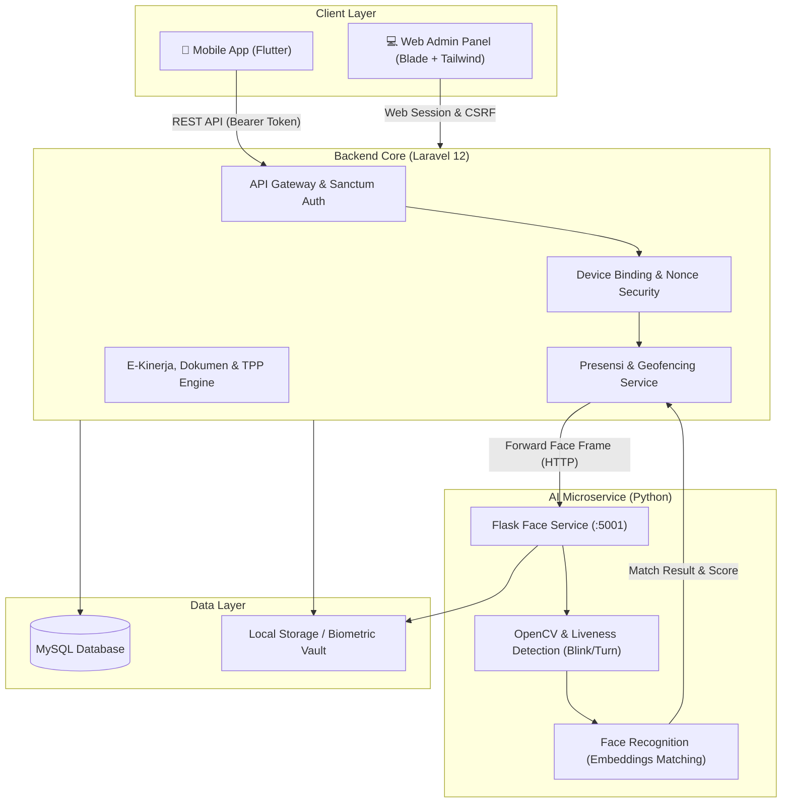

# 🏛️ SIAPMAN - Backend API & Admin Web Portal
### Sistem Informasi Absensi dan Pelaporan Manajemen

  Platform manajemen presensi modern berbasis AI Face Recognition & Geofencing GPS untuk instansi pemerintah dan perusahaan. Terintegrasi dengan Mobile App (Flutter) serta Web Admin Dashboard untuk rekapitulasi kehadiran, e-kinerja harian, verifikasi dokumen ketidakhadiran, dan kalkulasi TPP.

---

---

## 📖 Tentang Proyek

**SIAPMAN (Sistem Informasi Absensi dan Pelaporan Manajemen)** dirancang untuk menyelesaikan berbagai tahapan presensi konvensional melalui otomasi digital yang aman, transparan, dan akurat. Sistem ini mengintegrasikan:
1. **AI Face Recognition & Liveness Detection**: Mencegah kecurangan presensi (*spoofing*, foto layar, wajah) dengan verifikasi tantangan aktif seperti berkedip (*blink*) dan menoleh (*head turn*).
2. **Device Binding**: Mengikat akun pegawai ke satu perangkat terdaftar (UUID/IMEI) untuk mencegah titip absen.
3. **E-Kinerja & Dokumen Ketidakhadiran**: Fasilitas pelaporan kegiatan harian (*daily activities*), pengajuan izin/cuti/sakit dengan bukti digital, serta pelaporan kendala presensi.
4. **Kalkulasi Pemotongan TPP**: Perhitungan otomatis keterlambatan dan ketidakhadiran terhadap persentase Tambahan Penghasilan Pegawai (TPP).

---

## 🏗️ Arsitektur Sistem

---

## ✨ Fitur Utama

### 🔐 1. Keamanan & Akses Terkendali
- **Laravel Sanctum Token Authentication**: Autentikasi API yang ringan dan aman untuk aplikasi mobile.
- **Single Device Binding**: Akun pegawai dikunci pada perangkat tertentu; perubahan perangkat memerlukan persetujuan administrator.
- **Request Nonce & Replay Attack Defense**: Setiap request presensi wajah dilengkapi nonce bertenggat waktu untuk mencegah replay attack.
- **Multi-Role System**: Pemisahan hak akses antara **Superadmin**, **Admin Instansi**, dan **Pegawai**.

### 👤 2. AI Biometrik Wajah & Anti-Spoofing
- **Face Registration**: Ekstraksi dan enkripsi facial embeddings pegawai.
- **Real-Time Liveness Detection**: State machine cerdas yang meminta tantangan acak (*blink*, *turn head*, deteksi mulut) untuk memastikan kehadiran fisik asli.
- **Passive Anti-Spoofing**: Filter otomatis terhadap blur, pantulan cahaya layar (*highlights*), dan foto statis.
- **Threshold Tuning**: Toleransi kecocokan wajah yang dapat dikonfigurasi melalui `.env`.

### 📋 3. E-Kinerja & Dokumen Ketidakhadiran
- **Laporan Kegiatan Harian (Daily Activities)**: Pegawai mengunggah rincian pekerjaan harian untuk kebutuhan e-kinerja.
- **Pengajuan Ketidakhadiran**: Pengajuan surat sakit, cuti, atau izin dinas dengan lampiran file pendukung (PDF/JPG).
- **Approval Workflow**: Admin dapat menyetujui (*approve*) atau menolak (*reject*) pengajuan izin dengan catatan verifikasi.
- **Lapor Kendala Absensi**: Pelaporan masalah teknis (misal error GPS / kamera) yang dapat diverifikasi oleh admin.

### 📊 4. Rekapitulasi Laporan & Kalkulasi TPP
- Rekap presensi harian dan bulanan per instansi/unit kerja.
- Perhitungan akumulasi keterlambatan dan jam kerja efektif.
- Kalkulasi otomatis persentase pengurangan TPP (Tambahan Penghasilan Pegawai).
- Ekspor rekapitulasi data ke format Excel (`Maatwebsite/Excel`) dan PDF siap cetak.

---

## 🛠️ Teknologi yang Digunakan

| Komponen | Teknologi | Keterangan |
|---|---|---|
| **Backend Framework** | Laravel 12.x | REST API & Web Dashboard MVC |
| **Bahasa Pemrograman** | PHP 8.2+ | Strong typing & performa tinggi |
| **Autentikasi** | Laravel Sanctum | API Token & Session Auth |
| **Face Service** | Python 3.10+, Flask | Microservice biometrik wajah |
| **Computer Vision** | OpenCV, `face_recognition`, dlib | Deteksi wajah, landmarks, dan anti-spoofing |
| **Frontend Web** | Blade, Tailwind CSS 3.x, Alpine.js | UI modern, responsif, dan elegan |
| **Build Tool** | Vite | Asset bundling super cepat |
| **Database** | MySQL 8.0+ / MariaDB | Relational Database Engine |
| **Client App** | Flutter (Dart) | Mobile client untuk pegawai |

---

## 📄 Lisensi

Proyek ini dilisensikan di bawah [MIT License](LICENSE). Bebas digunakan, dimodifikasi, dan didistribusikan untuk keperluan pengembangan dan edukasi.

---

  Dikembangkan dengan ❤️ untuk modernisasi tata kelola presensi & kinerja aparatur.

