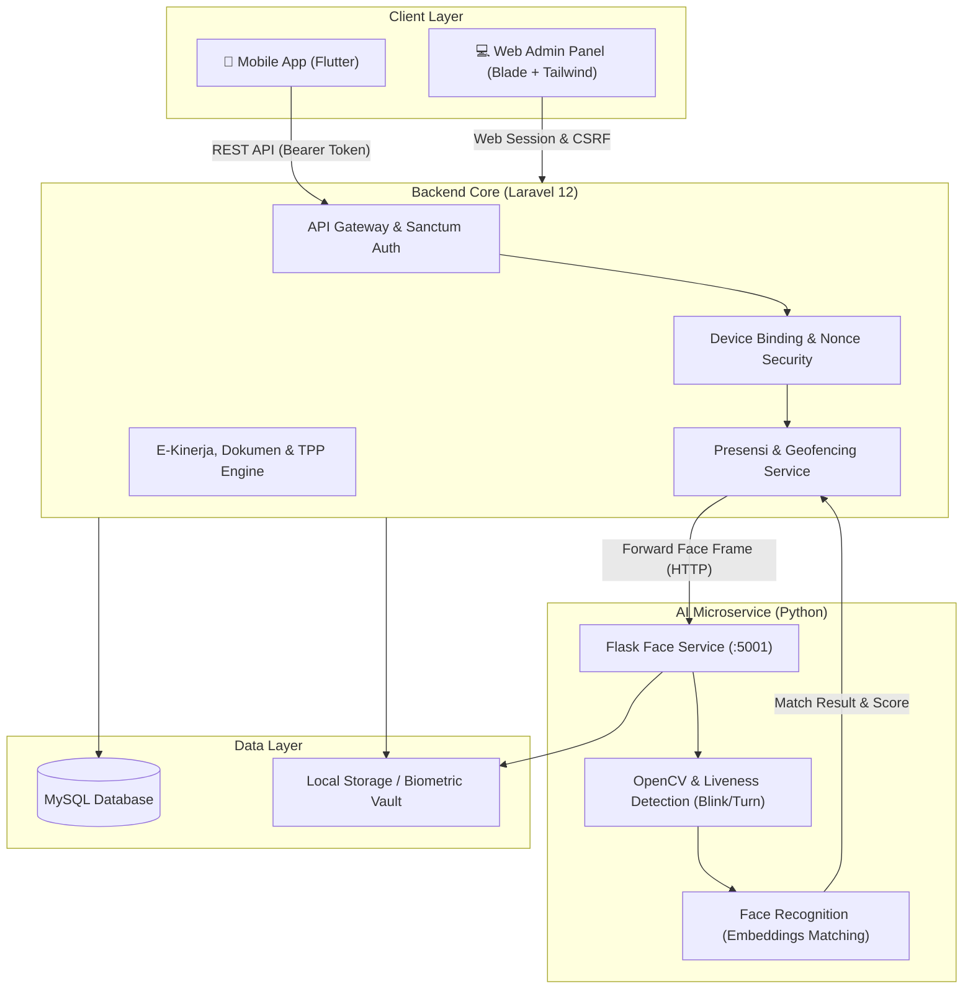

<div align="center">

# 🏛️ SIAPMAN - Backend API & Admin Web Portal
### Sistem Informasi Absensi dan Pelaporan Manajemen

[](https://laravel.com)
[](https://www.php.net/)
[](https://www.python.org/)
[](https://flask.palletsprojects.com/)
[](https://opencv.org/)
[](https://www.mysql.com/)
[](https://tailwindcss.com/)
[](LICENSE)

<p align="center">
  Platform manajemen presensi modern berbasis AI Face Recognition & Geofencing GPS untuk instansi pemerintah dan perusahaan. Terintegrasi dengan Mobile App (Flutter) serta Web Admin Dashboard untuk rekapitulasi kehadiran, e-kinerja harian, verifikasi dokumen ketidakhadiran, dan kalkulasi TPP.
</p>

---

</div>

## 📌 Daftar Isi
- [Tentang Proyek](#-tentang-proyek)
- [Arsitektur Sistem](#-arsitektur-sistem)
- [Fitur Utama](#-fitur-utama)
- [Teknologi yang Digunakan](#-teknologi-yang-digunakan)
- [Struktur Direktori](#-struktur-direktori)
- [Prasyarat Sistem](#-prasyarat-sistem)
- [Panduan Instalasi](#-panduan-instalasi)
  - [1. Clone Repository](#1-clone-repository)
  - [2. Setup Backend Laravel](#2-setup-backend-laravel)
  - [3. Setup Face Recognition Microservice](#3-setup-face-recognition-microservice)
  - [4. Setup Frontend Assets](#4-setup-frontend-assets)
- [Kredensial Default](#-kredensial-default)
- [Ringkasan Endpoint API](#-ringkasan-endpoint-api)
- [Role & Hak Akses](#-role--hak-akses)
- [Lisensi](#-lisensi)

---

## 📖 Tentang Proyek

**SIAPMAN (Sistem Informasi Absensi dan Pelaporan Manajemen)** dirancang untuk menyelesaikan berbagai tantangan presensi konvensional melalui otomasi digital yang aman, transparan, dan akurat. Sistem ini mengintegrasikan:
1. **AI Face Recognition & Liveness Detection**: Mencegah kecurangan presensi (*spoofing*, foto layar, topeng) dengan verifikasi tantangan aktif seperti berkedip (*blink*) dan menoleh (*head turn*).
2. **Geofencing & GPS Validation**: Memastikan pegawai melakukan presensi hanya di radius koordinat instansi/lokasi kerja yang diizinkan (Haversine algorithm).
3. **Device Binding**: Mengikat akun pegawai ke satu perangkat terdaftar (UUID/IMEI) untuk mencegah titip absen.
4. **E-Kinerja & Dokumen Ketidakhadiran**: Fasilitas pelaporan kegiatan harian (*daily activities*), pengajuan izin/cuti/sakit dengan bukti digital, serta pelaporan kendala presensi.
5. **Kalkulasi Pemotongan TPP**: Perhitungan otomatis keterlambatan dan ketidakhadiran terhadap persentase Tambahan Penghasilan Pegawai (TPP).

---

## 🏗️ Arsitektur Sistem



---

## ✨ Fitur Utama

### 🔐 1. Keamanan & Akses Terkendali
- **Laravel Sanctum Token Authentication**: Autentikasi API yang ringan dan aman untuk aplikasi mobile.
- **Single Device Binding**: Akun pegawai dikunci pada perangkat tertentu; perubahan perangkat memerlukan persetujuan administrator.
- **Request Nonce & Replay Attack Defense**: Setiap request presensi wajah dilengkapi nonce bertenggat waktu untuk mencegah replay attack.
- **Multi-Role System**: Pemisahan hak akses antara **Superadmin**, **Admin Instansi**, dan **Pegawai**.

### 👤 2. AI Biometrik Wajah & Anti-Spoofing
- **Face Registration**: Ekstraksi dan enkripsi facial embeddings pegawai.
- **Real-Time Liveness Detection**: State machine cerdas yang meminta tantangan acak (*blink*, *turn head*, deteksi mulut) untuk memastikan kehadiran fisik asli.
- **Passive Anti-Spoofing**: Filter otomatis terhadap blur, pantulan cahaya layar (*highlights*), dan foto statis.
- **Threshold Tuning**: Toleransi kecocokan wajah yang dapat dikonfigurasi melalui `.env`.

### 📍 3. Presensi & Geofencing GPS
- Validasi koordinat pegawai terhadap radius lokasi instansi (Geofencing).
- Validasi jadwal jam masuk, jam pulang, dan toleransi keterlambatan.
- Pencegahan *double check-in* atau *double check-out* pada hari yang sama.
- Validasi alur: tidak dapat melakukan presensi pulang sebelum presensi masuk.
- Penyimpanan bukti foto snapshot pada saat presensi.

### 📋 4. E-Kinerja & Dokumen Ketidakhadiran
- **Laporan Kegiatan Harian (Daily Activities)**: Pegawai mengunggah rincian pekerjaan harian untuk kebutuhan e-kinerja.
- **Pengajuan Ketidakhadiran**: Pengajuan surat sakit, cuti, atau izin dinas dengan lampiran file pendukung (PDF/JPG).
- **Approval Workflow**: Admin dapat menyetujui (*approve*) atau menolak (*reject*) pengajuan izin dengan catatan verifikasi.
- **Lapor Kendala Absensi**: Pelaporan masalah teknis (misal error GPS / kamera) yang dapat diverifikasi oleh admin.

### 📊 5. Rekapitulasi Laporan & Kalkulasi TPP
- Rekap presensi harian dan bulanan per instansi/unit kerja.
- Perhitungan akumulasi keterlambatan dan jam kerja efektif.
- Kalkulasi otomatis persentase pengurangan TPP (Tambahan Penghasilan Pegawai).
- Ekspor rekapitulasi data ke format Excel (`Maatwebsite/Excel`) dan PDF siap cetak.

---

## 🛠️ Teknologi yang Digunakan

| Komponen | Teknologi | Keterangan |
|---|---|---|
| **Backend Framework** | Laravel 12.x | REST API & Web Dashboard MVC |
| **Bahasa Pemrograman** | PHP 8.2+ | Strong typing & performa tinggi |
| **Autentikasi** | Laravel Sanctum | API Token & Session Auth |
| **Face Service** | Python 3.10+, Flask | Microservice biometrik wajah |
| **Computer Vision** | OpenCV, `face_recognition`, dlib | Deteksi wajah, landmarks, dan anti-spoofing |
| **Frontend Web** | Blade, Tailwind CSS 3.x, Alpine.js | UI modern, responsif, dan elegan |
| **Build Tool** | Vite | Asset bundling super cepat |
| **Database** | MySQL 8.0+ / MariaDB | Relational Database Engine |
| **Client App** | Flutter (Dart) | Mobile client untuk pegawai |

---

## 📁 Struktur Direktori

```text
siapman_api/
├── app/
│   ├── Http/
│   │   ├── Controllers/
│   │   │   ├── Admin/           # Controller Web Admin Instansi (Verifikasi, Monitoring)
│   │   │   ├── Api/             # Controller REST API Mobile (Auth, Face, Dokumen, dll)
│   │   │   └── SuperAdmin/      # Controller Superadmin (Pegawai, Jadwal, Lokasi, Master)
│   │   ├── Middleware/          # Role, Device Binding, Request Nonce middleware
│   │   └── Requests/            # Form Request Validation
│   └── Models/                  # Eloquent Models (User, AttendanceLog, Employee, dll)
├── config/                      # Konfigurasi aplikasi & face service
├── database/
│   ├── migrations/              # 40+ migrasi database terstruktur
│   └── seeders/                 # Seeder user, data master, dan jadwal
├── face_service/                # Microservice Python AI Face Recognition
│   ├── app.py                   # Flask server liveness & face matching
│   ├── known_faces/             # Direktori cache embeddings wajah
│   └── requirements.txt         # Dependensi Python
├── public/                      # Public web assets & storage symlink
├── resources/
│   ├── views/                   # Template Blade (Superadmin, Admin, Auth)
│   ├── css/                     # Tailwind CSS
│   └── js/                      # Frontend JavaScript
├── routes/
│   ├── api.php                  # Endpoint REST API Mobile
│   ├── web.php                  # Rute Web Dashboard Admin/Superadmin
│   └── auth.php                 # Rute autentikasi Breeze
└── storage/                     # Log, cache, dan upload dokumen presensi
```

---

## ⚙️ Prasyarat Sistem

Sebelum memulai instalasi, pastikan lingkungan pengembangan Anda telah terpasang:
- **PHP** `>= 8.2` (dengan ekstensi: `pdo_mysql`, `mbstring`, `openssl`, `gd`, `curl`, `xml`, `zip`)
- **Composer** `>= 2.x`
- **Node.js** `>= 18.x` & **npm**
- **Python** `>= 3.10` & **pip**
- **CMake & C++ Build Tools** (diperlukan untuk kompilasi library `dlib` pada Python)
- **MySQL Server** `>= 8.0`

---

## 🚀 Panduan Instalasi

### 1. Clone Repository
```bash
git clone https://github.com/Nurfaridamardzyska/siapman_laravel.git
cd siapman_laravel
```

### 2. Setup Backend Laravel
1. Pasang dependensi PHP:
   ```bash
   composer install
   ```

2. Gandakan file `.env` dan sesuaikan konfigurasi:
   ```bash
   cp .env.example .env
   ```

3. Generate Application Key:
   ```bash
   php artisan key:generate
   ```

4. Konfigurasikan database pada `.env`:
   ```env
   DB_CONNECTION=mysql
   DB_HOST=127.0.0.1
   DB_PORT=3306
   DB_DATABASE=siapman_api
   DB_USERNAME=root
   DB_PASSWORD=your_password

   FACE_SERVICE_URL=http://127.0.0.1:5001
   FACE_MATCH_THRESHOLD=0.6
   ```

5. Jalankan migrasi dan seeder database:
   ```bash
   php artisan migrate --seed
   ```

6. Buat tautan penyimpanan (*storage link*):
   ```bash
   php artisan storage:link
   ```

### 3. Setup Face Recognition Microservice
1. Masuk ke direktori `face_service`:
   ```bash
   cd face_service
   ```

2. Buat dan aktifkan *virtual environment*:
   ```bash
   # macOS / Linux
   python3 -m venv venv
   source venv/bin/activate

   # Windows
   python -m venv venv
   venv\Scripts\activate
   ```

3. Pasang dependensi Python:
   ```bash
   pip install -r requirements.txt
   ```

4. Jalankan Face Recognition Microservice (berjalan pada port `5001`):
   ```bash
   python app.py
   ```

### 4. Setup Frontend Assets
Buka terminal baru di root folder proyek, lalu pasang dependensi JavaScript dan lakukan build:
```bash
npm install
npm run build
```

Untuk mode development (hot-reload):
```bash
npm run dev
```

### 5. Menjalankan Server Laravel
```bash
php artisan serve
```
Aplikasi web dapat diakses melalui: **`http://localhost:8000`**  
Endpoint API mobile dapat diakses melalui: **`http://localhost:8000/api`**

---

## 🔑 Kredensial Default

Setelah menjalankan `php artisan migrate --seed`, akun berikut tersedia untuk pengujian:

| Role | Username / Email | Password | Hak Akses |
|---|---|---|---|
| **Super Admin** | `superadmin` / `angelodesigncraft@gmail.com` | `password` | Seluruh kontrol master data, instansi, pegawai, dan sistem |
| **Admin Instansi** | `admin` / `admin@gmail.com` | `password` | Verifikasi izin, verifikasi kendala, dan monitoring presensi |
| **Pegawai Dummy** | `pegawai1` / `pegawai1@gmail.com` | `password` | Login mobile app, absensi wajah, e-kinerja, dan pengajuan izin |

---

## 📡 Ringkasan Endpoint API

Semua request berotentikasi mewajibkan header: `Authorization: Bearer <TOKEN>`.

### Autentikasi
| Method | Endpoint | Deskripsi |
|---|---|---|
| `POST` | `/api/login` | Login user (NIP/Username, password, device_id) |
| `GET` | `/api/me` | Profil data user yang sedang login |

### Biometrik Wajah & Presensi
| Method | Endpoint | Deskripsi |
|---|---|---|
| `POST` | `/api/register-face` | Registrasi wajah awal pegawai |
| `GET` | `/api/face/liveness/status` | Status alur liveness detection |
| `POST` | `/api/face/liveness/frame` | Kirim frame kamera untuk evaluasi tantangan (*blink/turn*) |
| `POST` | `/api/face/liveness/reset` | Reset sesi liveness |
| `POST` | `/api/attendance-face` | Verifikasi presensi (Masuk / Pulang) dengan koordinat GPS |
| `GET` | `/api/attendance-history` | Riwayat presensi user |
| `GET` | `/api/today-attendance` | Status presensi hari ini |

### Dokumen & E-Kinerja
| Method | Endpoint | Deskripsi |
|---|---|---|
| `GET` | `/api/document-types` | Daftar tipe dokumen izin/cuti |
| `GET` | `/api/absence-documents` | Riwayat pengajuan dokumen izin |
| `POST` | `/api/absence-documents` | Unggah pengajuan izin / sakit / cuti |
| `GET` | `/api/daily-activities` | Daftar laporan aktivitas harian |
| `POST` | `/api/daily-activities` | Input laporan aktivitas harian (E-Kinerja) |
| `GET` | `/api/fault-reports` | Daftar laporan kendala absensi |
| `POST` | `/api/fault-reports` | Kirim laporan kendala teknis |
| `GET` | `/api/tpp-percentage` | Persentase kalkulasi TPP dan potongan |

---

## 👥 Role & Hak Akses

```
┌─────────────────────────────────────────────────────────────┐
│                        SUPERADMIN                           │
│  - Manajemen OPD / Instansi, Lokasi Absen, Mesin Presensi   │
│  - Kelola Pegawai, Akun Pengguna & Reset Perangkat Terikat │
│  - Konfigurasi Jadwal Kerja, Jam Toleransi & Hari Libur     │
│  - Rekapitulasi Laporan Presensi & Kalkulasi Potongan TPP   │
└──────────────────────────────┬──────────────────────────────┘
                               │
┌──────────────────────────────┴──────────────────────────────┐
│                       ADMIN INSTANSI                        │
│  - Monitoring Presensi Real-Time Harian                     │
│  - Verifikasi / Approval Pengajuan Dokumen Izin & Sakit     │
│  - Verifikasi / Approval Laporan Kendala Absensi            │
│  - Ekspor Data Presensi Pegawai ke Excel                    │
└──────────────────────────────┬──────────────────────────────┘
                               │
┌──────────────────────────────┴──────────────────────────────┐
│                       PEGAWAI (MOBILE)                      │
│  - Registrasi & Verifikasi Presensi Wajah (Anti-Spoofing)   │
│  - Pelaporan Kegiatan Harian (E-Kinerja)                    │
│  - Pengajuan Surat Izin / Cuti / Sakit                      │
│  - Pemantauan Riwayat Kehadiran & Status Potongan TPP       │
└─────────────────────────────────────────────────────────────┘
```

---

## 📄 Lisensi

Proyek ini dilisensikan di bawah [MIT License](LICENSE). Bebas digunakan, dimodifikasi, dan didistribusikan untuk keperluan pengembangan dan edukasi.

---

<div align="center">
  <sub>Dikembangkan dengan ❤️ untuk modernisasi tata kelola presensi & kinerja aparatur.</sub>
</div>
